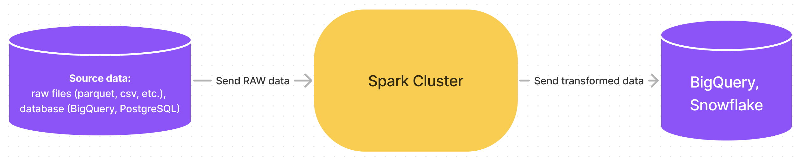
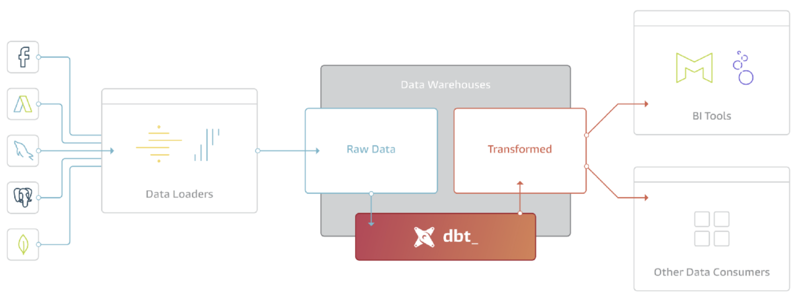
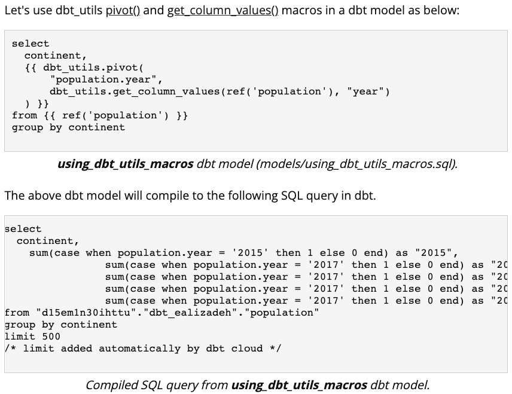
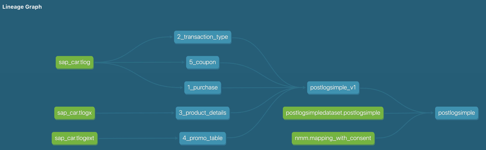

public:: true

- Presentation 26 October 2022 - `dbt` introduction
	- What problems do `dbt` solve?
	  collapsed:: true
		- History: MapReduce, and then Spark
		  collapsed:: true
			- Cluster computation (many servers) of "big data", usually transformation. Jobs running in Java Virtual Machine, APIs in Python, Scala and Java.
			  collapsed:: true
				- 
				-
			- Overhead: send data from source to cluster; (after compute/transform) send data from cluster to data warehouse
			  collapsed:: true
				- 
		- https://www.getdbt.com/blog/what-exactly-is-dbt/
		  collapsed:: true
			- Radical idea: modern data warehouses are very scalable (storage and compute), why not just **use the data warehouse itself for the transformation**?
			  collapsed:: true
				- 
			- `dbt`: a tool that makes it easier to create and manage transformations _inside_ the data warehouse?
	- `dbt` does mainly 3 things
	  collapsed:: true
		- 1: a **compiler**. It compiles jinja templating language with parameters to raw (BigQuery) SQL.
		  collapsed:: true
			- Jinja2 templating
			  collapsed:: true
				- {:height 308, :width 500}
			- `dbt compile` - takes `SQL` + `jinja` as input, and compiles to "pure" SQL
			  collapsed:: true
				- 
				- output should always be "pure" SQL supported by the data warehouse - in our case BigQuery SQL.
		- 2: a **runner**. It will connect to your data warehouse and run the compiled SQL files (from step 1).
		  collapsed:: true
			- In the order of the lineage graph (sort of a Directed Acyclic Graph, DAG)
			  collapsed:: true
				- 
			- `dbt run` example: creates intermediate+final tables/views, in the correct order.
			  collapsed:: true
				- https://d33wubrfki0l68.cloudfront.net/2af91d604961ad35dc4f59732e0320ee6809d17f/01d78/img/first-model-dbt-cli.png
			- `dbt run` can easily be scheduled
		- 3: a **documenter**. It can create documentation for the source, intermediate and end tables, as well as lineage graph(s).
		  collapsed:: true
			- `transactional-pipeline` `dbt` docs: https://bookish-potato-e130ff44.pages.github.io/
			- Overview of many things, including: source tables; source (pre-compiled) and compiled code; macros (`dbt` functions), and lineage graph(s).
	- `dbt` - developing and running in production
	  collapsed:: true
		- You can (and should) install `dbt` **locally**, this is where you'd want to develop your `dbt` code.
		  collapsed:: true
			- Run e.g. `dbt compile` locally to check that your code does not have syntax errors and returns valid BigQuery SQL.
			- Test `dbt run` in a `test` or `dev` GCP environment (in container)
		- **Production**: we want to run `dbt` in a Docker container on GCP
		  collapsed:: true
			- GCP options for running container:
			  collapsed:: true
				- "Cloud Build"
				- "Vertex AI Pipelines"
				- "Cloud Run"
				- "Cloud Run Jobs"
				  collapsed:: true
					- If you only want schedule `dbt run` to run on regular intervals, e.g. every morning, deploying `dbt` on "Cloud Run Jobs" with the Python package `goblet` might be the easiest.
						- There exists a template for this: https://github.com/coopnorge/dbt-template
					- If `dbt run` needs to be part of a more complex orchestration pattern (DAG) or you want to trigger it based on events (e.g. a file is received in "Cloud Storage"), "Cloud Run Jobs" will not suit your needs.
			- Cons with this approach: scattered, independent `dbt` jobs and docs.
	- In addition
	  collapsed:: true
		- `dbt test` - data tests
		- `dbt seed` - include CSV files
- Folder structures
	- Multiple `models`
	  collapsed:: true
		- `models` (each model gets their own BQ `dataset`)
		  collapsed:: true
			- `common`
			- `non-food`
				- consumes tables produced by `common`
			- `bygg`
				- consumes tables produced by `common`
			-
-